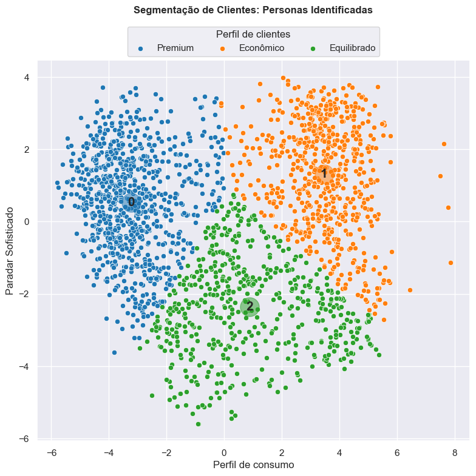
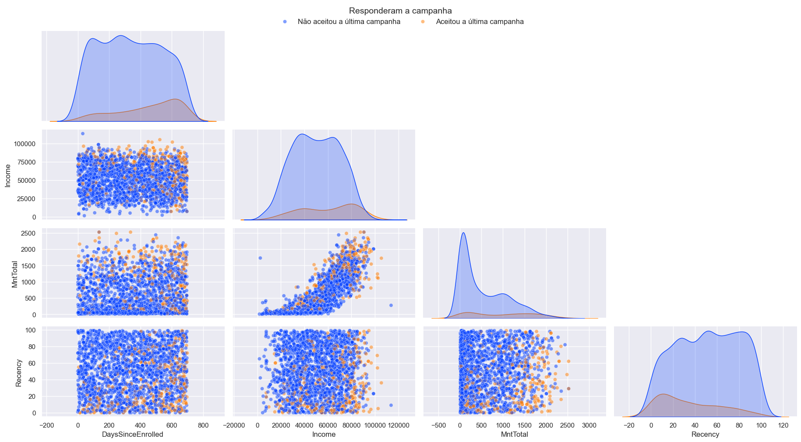
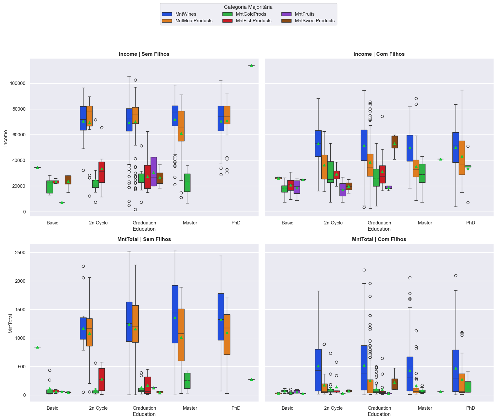
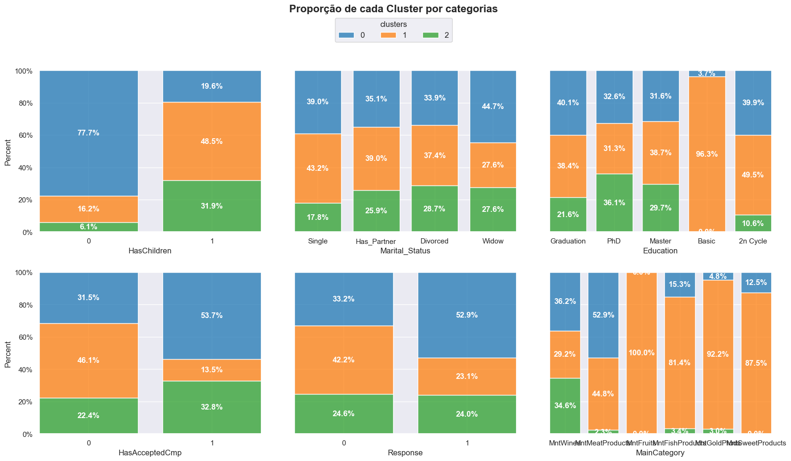
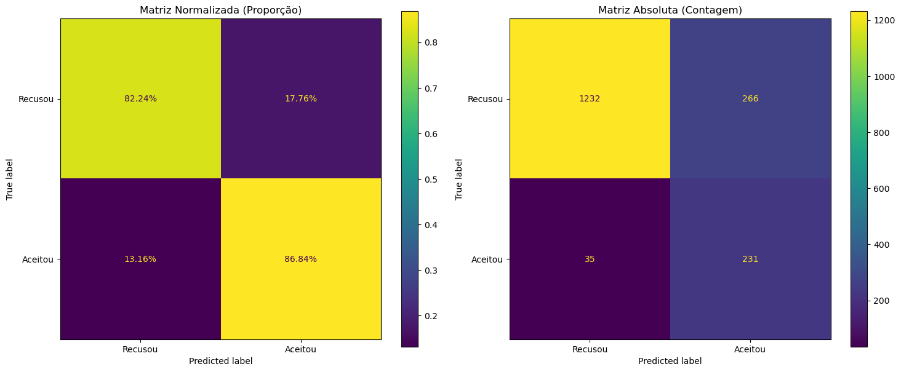

# Análise de clusterização de clientes de um varejo



# Sobre a base de dados e contexto inicial
## Explicação geral da base

Considere uma empresa do varejo de alimentos que possuem milhares de clientes registrados. Eles vendem produtos de 5 grandes categorias: vinhos, carnes, frutas exóticas, peixes especialmente preparados e produtos doces; que ainda se agrupam em produtos _gold_ e regulares. Os clientes podem encomendar e adquirir produtos por meio de 3 canais de vendas: lojas físicas, catálogos e site da empresa. Em geral, a empresa obteve uma boa performance nos últimos 3 anos, mas as perspectivas de crescimento dos lucros não são promissoras. Isso motivou a várias iniciativas estratégicas estão sendo consideradas para inverter essa situação. Uma delas é melhorar o desempenho das atividades de _marketing_, com foco especial em campanhas.

O departamento de _marketing_ foi pressionado a investir seu orçamento com mais eficiência e _data-driven_. O _CMO_ percebe a importância de ter uma abordagem mais quantitativa ao tomar decisões, para isso o desafio inicial foi construir um **modelo preditivo** que apoiará iniciativas de _marketing_.

## Contexto técnico

1. [Dicionário de dados](referencias/dicio_dados.md)
2. [Base de dados](dados/ml_project1_data.csv)

## Origem dos dados
Essa é uma base de dados originária de um processo seletivo para o time de analistas de dados do Ifood. Detalhes e intruções mais detalhadas podem ser obtidas no link: [dados ifood](https://github.com/kdutrajano/ifood-data-business-analyst-test). Este projeto usará essa base como referência e contexto acima, porém objetivos adaptados.

- [Case original](referencias/iFood_Case.pdf)

# Objetivo do projeto

Este projeto tem objetivos adaptados pontos de discussão a mais do que os originalmente propostos no processo seletivo. São eles:

1. **Encontrar perfis de consumidores** pelo padrão de comportamento correlacionando variáveis da base, aplicando técnicas de _feature engineering_, usando métricas e discussões estatísticas pertinentes;
2. Avaliar **diversos modelos de _clustering_** aplicando métricas imparciais para refinar o estudo das categorias, encontrar padrões gerais e características indiretas presentes na base por completo (método tradicional) para os diversos níveis de _stakeholders_ da forma mais detalhada possível;

3. Realizar estudo com o modelo mais pertinente de forma simplificada a partir de uma **técnica de redução de dimensionalidade (PCA)** para facilitar o entendimento de mais alto;

4. Criar um **modelo classificação** que permita entender de forma simples o potencial de conversão de cada cliente. 

Assim, mantendo o laço com o contexto original, será possível traçar estratégias gerais pela equipe de marketing para direcionar campanhas (de acordo com entregáveis 1, 2 e 3), tal como estratégias específicas para clientes em oportunidades na _web_, catálogos e lojas físicas (de acordo com entregáveis 2, 3 e 4).


## Organização do projeto

```
├── .gitignore         <- Arquivos e diretórios a serem ignorados pelo Git
├── ambiente.yml       <- O arquivo de requisitos para reproduzir o ambiente de análise
├── LICENSE            <- Licença de uso do código
├── README.md          <- README principal para desenvolvedores que usam este projeto.
|
├── dados              <- Arquivos de dados para o projeto e resultados dos notebooks.
├── notebooks          <- Cadernos Jupyter.
│
|   └──src             <- Código-fonte para uso neste projeto.
|      │
|      ├── __init__.py    <- Torna um módulo Python
|      ├── auxiliares.py  <- Funções auxiliares básicas do projeto
|      ├── config.py      <- Configurações básicas do projeto
|      ├── graficos.py    <- Scripts para criar visualizações exploratórias e orientadas a resultados
|      └── models.py      <- Funções para EDA
|
├── referencias        <- Dicionários de dados, manuais e todos os outros materiais explicativos pertinentes.
|
├── relatorios         <- Análises geradas em HTML, PDF, LaTeX, etc.
│   └── imagens        <- Gráficos e figuras gerados para serem usados em relatórios
```

## Configuração do ambiente

1. Faça o clone do repositório que será criado a partir deste modelo.

    ```bash
   https://github.com/Dnlsd/Customer_clustering.git
    ```

2. importe o ambiente virtual semelhante ao utilizado.

    a. Caso esteja utilizando o `conda`, use as dependências do ambiente para o arquivo `ambiente.yml`:

      ```bash
      conda env create -f ambiente.yml
      ```

    b. Caso esteja utilizando outro gerenciador de ambientes, exporte as dependências para o arquivo `requirements.txt` ou outro formato de sua preferência. Adicione o arquivo ao controle de versão, removendo o arquivo `ambiente.yml`.


# Resultados
## Notebooks de referência

Análise Exploratória dos dados e discussão inicial: [EDA](notebooks/01_EDA.ipynb)<br>
Comparação de modelos de clusterização e discussão: [Clusterização](notebooks/02_clusterig.ipynb)<br>
Clusterização com PCA: [Clusterização PCA](notebooks/03_clusterig_PCA.ipynb)<br>
Criação do modelo e discussão do projeto: [Modelo de classificação](notebooks/04_classification.ipynb).<br>


## Principais Conclusões

### Análise de correlações:

Disponível em: [EDA](notebooks/01_EDA.ipynb)<br>


- **Sobre correlações e features**: 

1. Parece existir uma forte **influência dos filhos nessa base de clientes**, tal como uma certa fidelidade de clientes mais antigos e preferência por produtos da linha de vinhos e carnes. Isso pode ser percebido pela correlação negativa de `HasChildren`* com o engajamento das campanhas.


*Coluna criada artificialmente a partir de técnicas de _feature engineering_
<br>

2. Clientes que já aceitaram campanhas (`AcceptedTotal`)* criam um **hábito de resposta** (`MntTotal` e `DaySinceEnrolled`)*.


*Colunas criadas artificialmente a partir de técnicas de _feature engineering_

<br>

3. Existe uma boa relação de consumo entre as **categorias `MntWines` e `MntMeatProducts` e clientes de alta renda (`Income`)**; Esse pode ser um perfil a ser explorado no futuro.


*A coluna "Categoria Majoritária" (`MainCategory`) foi criada artificialmente a partir de técnicas de _feature engineering_

<br>

- **Sobre perfils de clientes**

Podemos definir inicialmente 3 perfils abrangentes de acordo com os gráficos e correlações que verificamos:

**1. Perfil de Alto Valor:** Adultos maduros (40-60 anos), geralmente sem filhos ou com alto nível educacional (PhD/Master). Focam em vinhos e carnes. Possuem a maior renda da base e são os principais compradores da linha Gold. Talvez existam **melhores oportunidades oferecendo produtos `Gold` e experiências de requinte (vendas em loja física e catálogos).**<br>

**2. Perfil de Volume:** Pais e mães de família (maioria da base). Consumidores de `produtos regulares`, doces e frutas. São "caçadores de ofertas" (`NumDealsPurchases`) e utilizam o site com frequência (`NumWebVisitsMonth`) para pesquisar preços. A oportunidade de capturar esse consumidor é em **campanhas de "massificação" focadas em conveniência, pacotes família e descontos agressivos em itens regulares**.<br>

**3. Perfil de Crescimento:** São mais jovens (<30/40 anos) e possuem um padrão de uso web previsível e demonstraram uma abertura maior à última campanha de marketing (`Response`). Réguas de relacionamento para transformá-los em "Connoisseurs" (perfil de alto valor) no futuro, incentivando a **primeira compra de vinhos ou carnes**.<br>

<br>

- **Sobre produtos e linhas de produtos**

1. O `vinho` é o motor do faturamento. Investigar se a venda ocorre na Loja Física (experiência) ou _Web_ (reposição) pode ser um direcionamento estratégico para a empresa. Se for física, o **marketing deve focar em "levar o cliente à loja"**.

2. Clientes de alta renda sem filhos compram ``Gold``, mas o volume ainda pode crescer. **Aumentar a visibilidade desta categoria** para o público de elite pode alavancar as vendas.

3. O desbalanço da base (mais maduros, com parceiros) reflete a realidade demográfica. As campanhas devem **parar de tentar converter o público `com filhos`** com ofertas de luxo e passar a oferecer utilidade, enquanto **reserva o luxo para os nichos de alta renda** e histórico de aceitação.


### Análise de clusters

Disponível em: [Clusterização](notebooks/02_clusterig.ipynb) e [Clusterização PCA](notebooks/03_clusterig_PCA.ipynb)<br>


**Descrição qualitativa dos clusters:**

* **Cluster 0 (Premium):** Representa o público de maior valor (renda, gastos altos) e o **mais receptivo a ações de marketing** (30%). A ausência de dependentes sugere maior renda disponível para consumo pessoal. O alto nível de escolaridade pode ser um elemento diferenciador nas escolhas de produtos e experiências.

* **Cluster 1 (Econômico/Jovem):** Possui o menor poder aquisitivo e menor engajamento com campanhas, apesar de alta frequência de visitas no site (possivelmente buscando itens de necessidade ou promoções específicas). Apesar do alto engajamento digital, possuem a menor taxa de aceitação de campanhas e uma escolaridade que abrange mais o nível básico, **sugerindo um consumidor mais sensível a preço** e que demanda ofertas muito agressivas para converter.É o único grupo com presença significativa de escolaridade básica e produtos em geral.

* **Cluster 2 (Maduro/Intermediário):** Perfil equilibrado com idade mais avançada, comportamento de consumo moderado e potencial de conversão em campanhas.

<br>



<br>


### Análise de modelos:

Disponível em: [Modelo de classificação](notebooks/04_classification.ipynb).<br>


O modelo de escolha baseado nas melhores métricas de avaliação de modelos de classificação foi o `LogisticRegression`. Modelos de gradiente e àrvores se mostrarm promissores, em especial os de gradiente com resultados semelhantes nas métricas e tempos otimizados (com é de se esperar para essa classe de modelos). O `LogisticRegression` prevaleceu, pois com ele temos um exemplo mais simples que os de Boosting ou Árvore; o que facilita a comunicação com áreas não-técnicas (como steakholders). 

O `LogisticRegression` foi configurado com uma **regularização L2** e parâmetro **C=1**, foi capaz de capturar padrões complexos sem sofrer indícios de sobreajuste (_overfitting_), apresentando uma **Curva ROC de 0.81** que indica uma excelente capacidade de distinção entre as classes. Embora o desafio de prever o comportamento humano seja intrinsecamente complexo, para o modelo características como educação, por exemplo, o **nível de escolaridade** (PHD) e preferências específicas (gostar de doces) são fortes indicadores positivos de conversão; Enquanto fatores como **Educação Básica** estão no oposto tendem a reduzir essa probabilidade. **Isso pode ser um indício de que a campanha piloto focou em clientes de premium (geralmente associados a alto nível de escolaridade e renda) e dependentes.**

Abaixo temos uma matriz de confusão para auxiliar na compreensão da capacidade de predição e classficação do modelo. [Confusion Matrix](https://scikit-learn.org/stable/auto_examples/model_selection/plot_confusion_matrix.html#evaluate-the-performance-of-a-classifier-with-confusion-matrix)

<br>



<br>

# Crétidos
## Modelo de projeto de ciência de dados

Desenvolvido por [Francisco Bustamante](https://github.com/chicolucio).

## Projeto

Adaptado do projeto desenvolvido no curso "Ciência de Dados Impressionadora" da Hashtag Treinamentos pelo professor [Francisco Bustamante](https://github.com/chicolucio)
